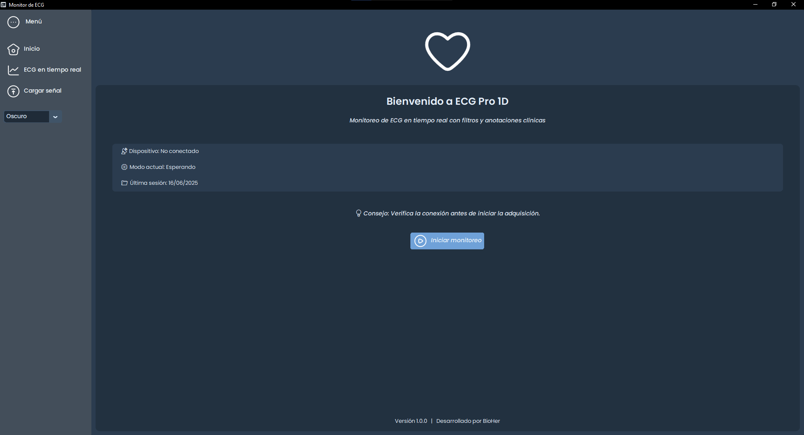
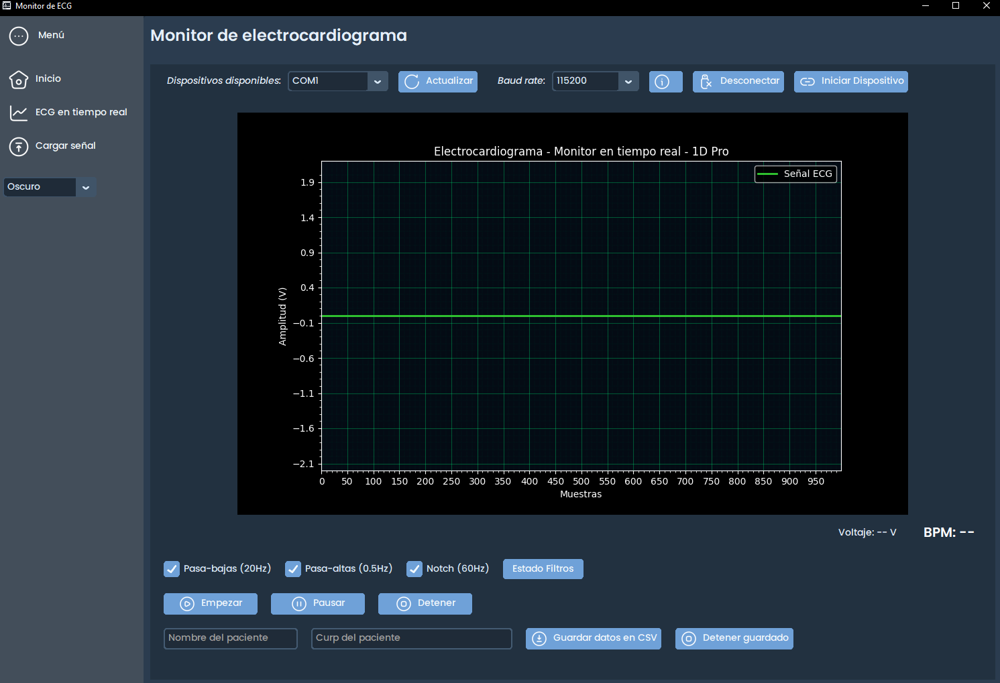
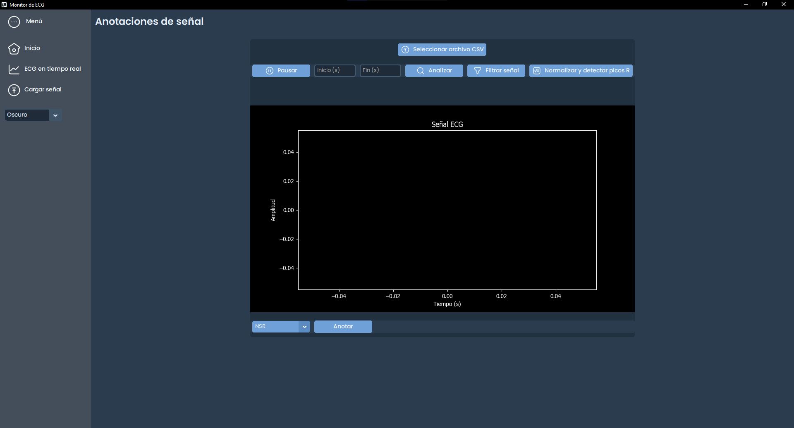

# 🫀 ECG Analyzer App



**ECG Analyzer App** es una aplicación profesional desarrollada en Python para la adquisición, análisis, anotación y exportación de señales ECG de 1 derivación, ideal para fines clínicos, académicos o de investigación. Incluye una interfaz gráfica moderna y herramientas de procesamiento digital avanzadas.

---

## 🧩 Características

- 📡 **Adquisición en tiempo real** desde Arduino o ESP32 por puerto serial.
- 🎚️ **Filtros digitales configurables**:
  - Pasa bajas
  - Pasa altas
  - Notch (60 Hz)
  - Butterworth, Bessel o Sallen-Key
- 📏 **Segmentación automática** de ondas P, QRS y T.
- 🧠 **Detección de arritmias**: NSR, AF, AFL, PVC, APB, ??, Otro.
- 🖍️ **Anotación manual** de tipo de latido y morfología (QRS angosto/amplio).
- 📈 Estadísticas de señal y cálculo de intervalos (PR, QRS, QT, RR).
- 💾 Exportación a **CSV**.
- 🗂️ Carga desde archivos CSV históricos.
- 🌐 Interfaz en **CustomTkinter** con diseño responsivo y profesional.

---

## 🖼️ Capturas de pantalla

### 📌 Ventana principal


### 🧠 Detección y análisis de ondas



### ✍️ Anotación manual



---

## 🛠️ Tecnologías utilizadas

- Python 3.10+
- [CustomTkinter](https://github.com/TomSchimansky/CustomTkinter)
- [CTkToolTip](https://github.com/Akascape/CTkToolTip)
- NumPy, SciPy, Matplotlib
- Pillow
- PySerial
- OS-agnostic (Windows)

---

## 📦 Instalación

```bash
git clone https://github.com/alexaemtz/ecg-app.git
cd ecg-app
pip install -r requirements.txt
python main.py
```

## 🧪 Requisitos

- Dispositivo Arduino/ESP32 conectado por USB
- Baud rate y puerto COM configurados correctamente (se puede cambiar en el código)
- Señal de ECG en formato analógico (electrodos y amplificador adecuados)

## 📄 Estructura del proyecto

ecg-app/  
│  
├── assets/ # Screenshots e icons  
├── modules/ # Módulos de adquisición, procesamiento y GUI  
├── themes/ # Temas personalizados (3)  
├── requirements.txt  
└── main.py # Punto de entrada de la aplicación

## 👩‍⚕️ Aplicaciones

- Monitoreo clínico básico
- Práctica académica en procesamiento de señales biomédicas
- Investigación en análisis de ritmos cardiacos
- Proyectos de ingeniería biomédica

## ✍️ Autor

**Alexa Escalante Martínez**
Estudiante de Ingeniería Biomédica en la Universidad de La Salle Bajío.

## 🛡️ Licencia

Este proyecto está bajo la licencia MIT. Ver [LICENSE](license.md) para más detalles
