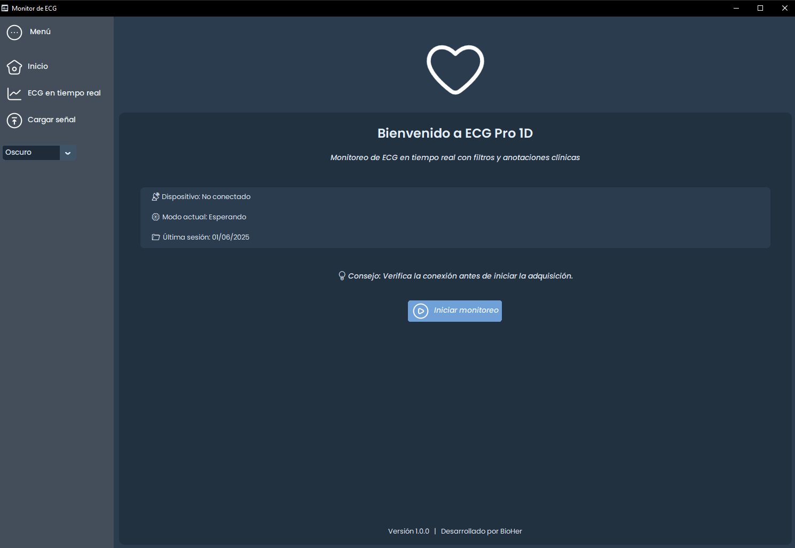

# ECG Analyzer App


Aplicación profesional de análisis de ECG de 1 derivación, diseñada para adquisición, procesamiento y visualización en tiempo real de señales cardiacas, con herramientas avanzadas de análisis, detección de arritmias y exportación de reportes.

---

## 🫀 Funcionalidades

- 📡 **Adquisición en tiempo real** desde Arduino o ESP32 vía puerto serial
- 🎚️ **Filtros** digitales personalizables: pasa baja, notch (Butterworth, Bessel, Sallen-Key)
- 📏 **Normalización** y procesamiento de señal
- 🔍 **Segmentación automática** de ondas P, QRS y T
- ⚠️ **Detección de arritmias**: NSR, AF, AFL, PVC, APB, Otros, ??
- 🧠 **Clasificación morfológica**: QRS angosto/amplio
- 📊 **Estadísticas** e intervalos cardiacos clave (RR, PR, QT, etc.)
- 📤 **Exportación de reportes**: CSV y PDF
- 📁 **Carga de archivos**: importación de ECG desde CSV
- 🗃️ **Base de datos local** con almacenamiento y búsqueda de registros
- ⚙️ Compatible con distintos **baud rates** y configuraciones seriales

---

## 🖥️ Capturas de Pantalla



---

## 🚀 Instalación

### Requisitos

- Python 3.10 o superior
- Arduino IDE o ESP32 configurado para enviar datos por puerto serial

### Dependencias

Instala las dependencias necesarias con:

```bash
pip install -r requirements.txt
